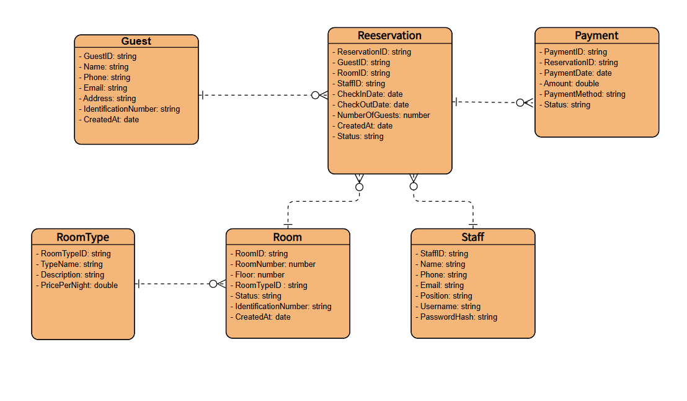

# Software Engineering Project – HotelBookingSystem

## Giới thiệu

**Họ và tên:** Hoàng Minh Hạnh
**MSSV:** N23DCPT021
**Lớp:** D23CQPT01-N

## Thiết kế Mini Project: Hệ thống quản lý đặt phòng khách sạn

### 1.Entity

- Guest (Khách hàng)
- RoomType (Loại phòng)
- Room (Phòng cụ thể)
- Reservation (Đặt phòng)
- Payment (Thanh toán)
- Staff (Nhân viên/Lễ tân/Quản lý)
  **Mối quan hệ:**
- Guest 1–N Reservation
- Reservation 1–N Payment
- RoomType 1–N Room
- Room 1–N Reservation
- Staff 1–N Reservation (lễ tân quản lý)
  

### 2.Use Case UML

**Các tác nhân chính:**

- Guest (Khách hàng)
- Receptionist (Lễ tân)
- Manager (Quản lý)
- Payment Gateway
- Housekeeping (Buồng phòng)
  **Use Case chính:**
- Tìm phòng, Xem chi tiết phòng
- Đặt phòng online (Booking)
- Thanh toán online
- Check-in / Check-out
- Quản lý phòng & giá
- Quản lý đặt phòng (cho lễ tân)
- Công việc buồng phòng
- Báo cáo doanh thu
  

### 3.Sequence UML

**Luồng Đặt phòng online**

- Guest chọn phòng → hệ thống giữ phòng (hold).
- Guest nhập thông tin → thực hiện thanh toán
- Cổng thanh toán trả kết quả → xác nhận & gửi email.
  

**Luồng Check-in/Check-out (Lễ tân)**

- Receptionist tra cứu mã đặt phòng.
- Check-in: gán phòng thực tế, cập nhật trạng thái.
- Check-out: tổng hợp chi phí, thu tiền, cập nhật buồng phòng.
  

### 4.Thiết kế cơ sở dữ liệu (ERD)

- Guest(GuestID, Name, Phone, Email, Address)
- RoomType(TypeID, Name, Price, Capacity, Description)
- Room(RoomID, TypeID, Status, Floor)
- Reservation(ResvID, GuestID, RoomID, StaffID, CheckInDate, CheckOutDate, Status)
- Payment(PaymentID, ResvID, Amount, Method, Status, Date)
- Staff(StaffID, Name, Role, Username, PasswordHash)
  

## Triển khai chi tiết trên Jira (Agile Scrum)

### Product Backlog

**Epic 1: Quản lý khách hàng (Auth)**

- Với vai trò là khách hàng, tôi muốn đăng ký tài khoản, để có thể đặt và quản lý phòng.
- Với vai trò là khách hàng, tôi muốn đăng nhập, để truy cập lịch sử đặt phòng.

**Epic 2: Tìm phòng & Xem chi tiết phòng**

- Với vai trò là khách hàng, tôi muốn tìm phòng trống theo ngày, để chọn phòng phù hợp.
- Với vai trò là khách hàng, tôi muốn xem chi tiết phòng, để hiểu rõ giá và tiện nghi.

**Epic 3: Đặt phòng & Thanh toán online**

- Với vai trò là khách hàng, tôi muốn đặt phòng và giữ chỗ, để đảm bảo có phòng khi đến.
- Với vai trò là khách hàng, tôi muốn thanh toán trực tuyến, để hoàn tất việc đặt phòng.

**Epic 4: Check-in/Check-out (Lễ tân)**

- Với vai trò là lễ tân, tôi muốn tra cứu thông tin đặt phòng, để xử lý check-in nhanh chóng.
- Với vai trò là lễ tân, tôi muốn gán phòng cụ thể khi khách check-in, để quản lý trạng thái phòng.
- Với vai trò là lễ tân, tôi muốn làm thủ tục check-out, để tính chi phí và thu tiền khách.

**Epic 5: Quản lý phòng & giá (Manager)**

- Với vai trò là quản lý, tôi muốn thêm/sửa/xóa loại phòng, để cập nhật dịch vụ.
- Với vai trò là quản lý, tôi muốn cập nhật giá phòng, để linh hoạt theo mùa hoặc khuyến mãi.

**Epic 6: Báo cáo doanh thu**

- Với vai trò là quản lý, tôi muốn xem báo cáo doanh thu theo ngày/tháng, để ra quyết định kinh doanh.

**Epic 7: Công việc buồng phòng**

- Với vai trò là nhân viên buồng phòng, tôi muốn xem danh sách phòng cần dọn, để chuẩn bị cho khách mới.
- Với vai trò là nhân viên buồng phòng, tôi muốn cập nhật trạng thái sau khi dọn, để quản lý phòng chính xác.

### Kế hoạch Sprint (Sprint Plan)

**Sprint 1 (2 tuần):**

- Đăng ký/Đăng nhập khách hàng
- Tìm phòng
- Xem chi tiết phòng

**Sprint 2 (2 tuần):**

- Đặt phòng & giữ chỗ (Reservation HOLD)
- Gửi email xác nhận

**Sprint 3 (2 tuần):**

- Thanh toán trực tuyến
- Check-in (lễ tân)
- Check-out (lễ tân)

**Sprint 4 (2 tuần):**

- Quản lý phòng & giá
- Báo cáo doanh thu

**Nhấn vào link sau đây để truy cập vào Jira:**[Jira-HotelBookingSystem](https://hoangminhhanh-n23dcpt021-hotelbookingsystem.atlassian.net/jira/software/projects/SCRUM/boards/1/backlog)
